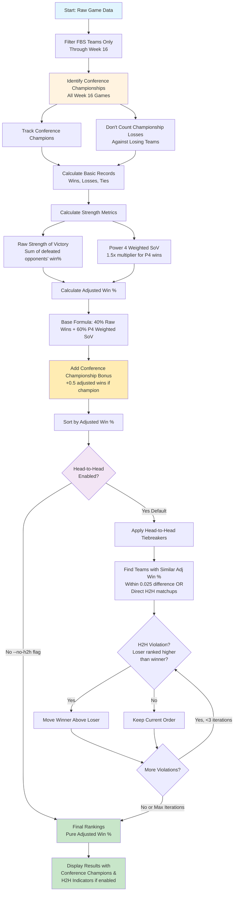

# CFB Rankings

A college football ranking system that uses Power 4 conference weighting, strength of victory calculations, conference championship bonuses, and optional head-to-head tiebreakers.

## Ranking Algorithm

The ranking system uses a sophisticated multi-step process to evaluate teams based on their record, strength of schedule, conference championships, and head-to-head results:



## Key Features

### Conference Championship System (Week 16)
- **All week 16 games are treated as conference championships**
- **Conference champions receive +0.5 adjusted win bonus**
- **Teams are NOT penalized for losing conference championship games**
- Championship games don't count as losses in team records
- Rewards teams for winning their conferences while protecting those who reach championships

### Power 4 Conference Weighting
- **SEC, Big Ten, Big 12, ACC** teams receive 1.5x multiplier for strength of victory
- Reflects the generally higher quality of competition in these conferences
- Other conferences (Group of 5, Independents) use standard 1.0x multiplier

### Strength of Victory Calculation
```
Raw SoV = Σ(defeated_opponent_win_percentage)
P4 Weighted SoV = Σ(defeated_opponent_win_percentage × conference_multiplier)
```

### Adjusted Win Percentage Formula
```
Base Adjusted Win % = (0.4 × Raw Wins) + (0.6 × P4_Weighted_SoV) / Total_Games
Final Adjusted Win % = Base + Conference_Championship_Bonus(+0.5)
```

### Head-to-Head Tiebreakers (Optional)
- **Enabled by default, disable with `--no-h2h` flag**
- Applied to teams with **similar adjusted win percentages** (within 0.025)
- Also applied to teams with **direct head-to-head matchups**
- Checks for head-to-head violations (loser ranked higher than winner)
- Moves winners above losers when violations found
- Includes cycle detection to prevent infinite loops
- Maximum 3 iterations to handle complex scenarios efficiently

## Usage

```bash
# Basic rankings for current season (2025) with head-to-head tiebreaking
uv run python src/rankings/build.py

# Rankings without head-to-head tiebreaking (pure adjusted win%)
uv run python src/rankings/build.py --no-h2h

# Specify different year
uv run python src/rankings/build.py --year 2024

# Analyze specific team
uv run python src/rankings/build.py --team "Ohio State"

# Compare two teams
uv run python src/rankings/build.py --compare "Oklahoma" "Alabama"

# Generate scatter plot
uv run python src/rankings/build.py --plot

# Download fresh data instead of using local cache
uv run python src/rankings/build.py --update

# Combine options (example: 2024 rankings without H2H and with fresh data)
uv run python src/rankings/build.py --year 2024 --no-h2h --update
```

## Example Output

The system shows conference championships and head-to-head adjustments in real-time:

```
Conference Championship: Indiana defeated Ohio State
Conference Championship: Georgia defeated Alabama
Conference Championship: Brigham Young defeated Texas Tech

Conference championship bonus applied to Indiana
Conference championship bonus applied to Georgia
Conference championship bonus applied to Brigham Young

  Oklahoma moved above Alabama (H2H win)

Final Rankings (Power 4 Conference Weighted Win Percentage):
===========================================================
Rank Team                      Overall Record  FBS Record   Raw Win%  Adj Win%  P4 Wins  SoV     H2H Beat     Conf Champ
===========================================================
1    Indiana                   13-0            11-0         1.000     0.991     10       10.000              YES
2    Ohio State                12-0            11-0         1.000     0.909     10       9.330
3    Brigham Young             12-1            11-1         0.917     0.883     9        9.500              YES
4    Georgia                   12-1            11-1         0.917     0.865     9        9.127              YES
10   Oklahoma                  10-2            9-2          0.818     0.728     7        7.343 Alabama
11   Alabama                   10-2            9-2          0.818     0.751     8        7.761

Legend: H2H Beat = Team that was beaten head-to-head to earn higher ranking
        Conf Champ = Conference championship winner (+0.5 adjusted win bonus)
```

### Without Head-to-Head Tiebreaking (`--no-h2h`):
```
Final Rankings (Power 4 Conference Weighted Win Percentage):
=======================================================
Rank Team                      Overall Record  FBS Record   Raw Win%  Adj Win%  P4 Wins  SoV     Conf Champ
=======================================================
1    Indiana                   13-0            11-0         1.000     0.991     10       10.000 YES
10   Alabama                   10-2            9-2          0.818     0.751     8        7.761
12   Oklahoma                  10-2            9-2          0.818     0.728     7        7.343

Legend: Conf Champ = Conference championship winner (+0.5 adjusted win bonus)
        Rankings based purely on adjusted win percentage (no head-to-head tiebreaking)
```

## Data Sources

- **Live Data**: Sports Reference (sports-reference.com) via web scraping
- **Local Cache**: CSV files stored in `data/schedule_{year}.csv`
- **FBS Team List**: Maintained list of all Division I FBS teams by conference