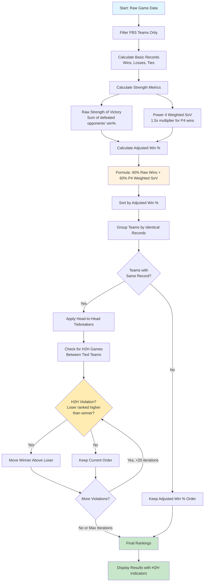

# CFB Rankings

A college football ranking system that uses Power 4 conference weighting and strength of victory calculations with head-to-head tiebreakers.

## Ranking Algorithm

The ranking system uses a sophisticated multi-step process to evaluate teams based on their record, strength of schedule, and head-to-head results:



## Key Features

### Power 4 Conference Weighting
- **SEC, Big Ten, Big 12, ACC** teams receive 1.5x multiplier for strength of victory
- Reflects the generally higher quality of competition in these conferences
- Other conferences (Group of 5, Independents) use standard 1.0x multiplier

### Strength of Victory Calculation
```
Raw SoV = Σ(defeated_opponent_win_percentage)
P4 Weighted SoV = Σ(defeated_opponent_win_percentage × conference_multiplier)
```

### Adjusted Win Percentage Formula
```
Adjusted Win % = (0.4 × Raw Wins) + (0.6 × P4_Weighted_SoV) / Total_Games
```

### Head-to-Head Tiebreakers
- Applied only to teams with **identical win-loss records**
- Checks for head-to-head violations (loser ranked higher than winner)
- Moves winners above losers within the same record group
- Includes cycle detection to prevent infinite loops
- Maximum 20 iterations to handle complex multi-team scenarios

## Usage

```bash
# Basic rankings for current season (2025)
uv run python src/rankings/build.py

# Specify different year
uv run python src/rankings/build.py --year 2024

# Analyze specific team
uv run python src/rankings/build.py --team "Ohio State"

# Compare two teams
uv run python src/rankings/build.py --compare "Oklahoma" "Alabama"

# Generate scatter plot
uv run python src/rankings/build.py --plot

# Download fresh data instead of using local cache
uv run python src/rankings/build.py --update
```

## Example Output

The system shows head-to-head adjustments in real-time:

```
Multiple teams with record (9-2): ['Alabama', 'Oklahoma', 'Utah', 'Virginia', 'Vanderbilt']
  Oklahoma moved above Alabama (H2H win)

Final Rankings:
Rank Team                      Overall Record  FBS Record   Raw Win%  Adj Win%  P4 Wins  SoV     H2H Beat
11   Oklahoma                  10-2            9-2          0.818     0.728     7        7.343   Alabama
12   Alabama                   10-2            9-2          0.818     0.750     8        7.750
```

## Data Sources

- **Live Data**: Sports Reference (sports-reference.com) via web scraping
- **Local Cache**: CSV files stored in `data/schedule_{year}.csv`
- **FBS Team List**: Maintained list of all Division I FBS teams by conference